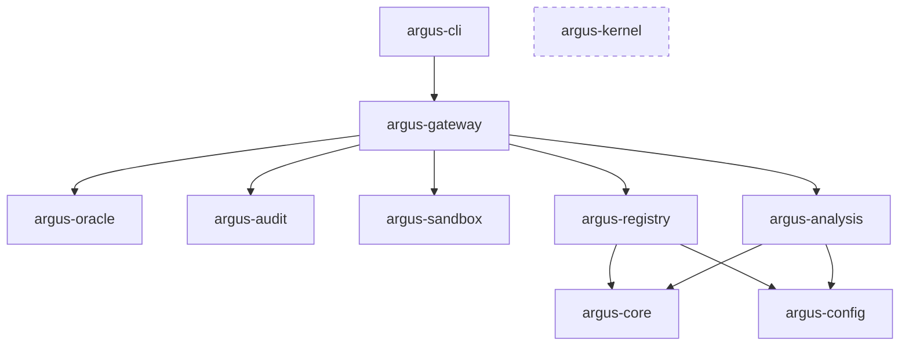

# Argus

> Work in progress.

Argus is a tool authorization gateway implementing the
[TzimtzumV2](../tzimtzum/) protocol. It acts as a local security daemon and universal
tool execution proxy for LLM agents, enforcing data-flow policies at tool boundaries
to prevent exfiltration via indirect prompt injection.

## Architecture



`argus-kernel` is standalone with zero workspace dependencies (rocq-of-rust compatible).

### Crates

| Crate | Description |
|-------|-------------|
| **argus-kernel** | Pure functional state machine implementing 9 TzimtzumV2 transitions. Zero workspace dependencies, compatible with [rocq-of-rust](https://github.com/formal-land/rocq-of-rust) extraction. Uses `BTreeMap`/`BTreeSet` exclusively. |
| **argus-gateway** | Main orchestration layer. Owns the kernel, manages MCP servers, handles gRPC serving, and coordinates the LLM API proxy. |
| **argus-oracle** | Policy engine backed by [Cedar](https://www.cedarpolicy.com/). Implements `AuthorizerOracle` for fine-grained tool authorization decisions. |
| **argus-registry** | TOML-based tool registry with git sync, cryptographic attestation, quarantine management, and SQLite persistence. |
| **argus-analysis** | LLM-powered security analysis using [rig-core](https://github.com/0xPlaygrounds/rig). Two-phase agentic pipeline (tool use + structured extraction). |
| **argus-sandbox** | Process sandboxing primitives. Landlock (Linux), seatbelt (macOS). Secret isolation via provider trait. |
| **argus-audit** | Event store and observability. OpenTelemetry integration for audit trails. |
| **argus-config** | Shared configuration types and loading. |
| **argus-core** | Shared domain types, capability catalog, and integrity levels. |
| **argus-cli** | CLI binary (`argus serve`, `argus analyze`). Daemon mode with MCP server lifecycle management. |

### Three Ingress Faces

1. **MCP host** -- Argus spawns sandboxed MCP servers and proxies tool calls through the invoke gate
2. **LLM API proxy** -- Transparent HTTP reverse proxy intercepting tool calls in LLM responses
3. **gRPC API** -- Direct access to the 9 kernel transitions for agent frameworks

### Kernel Transitions

The core state machine is pure functional -- each transition takes an immutable state and
returns a new state plus an event:

```
fn(KernelState, &BackgroundTheory, ...) -> Result<(KernelState, KernelEvent), KernelError>
```

The 9 transitions implement the TzimtzumV2 protocol: `register_tool`, `delegate`,
`revoke`, `cascade_revoke`, `invoke_start`, `invoke_complete`, `return_endorsed`,
`return_unendorsed`, `egress_check`.

## Formal Verification

The `formal/` directory contains Rocq (Coq) mechanized proofs organized in three layers:

- **axioms/** -- BTree data structure interfaces, decidability assumptions, oracle behavior
- **spec/** -- Abstract TzimtzumV2 specification with safety property proofs
- **refinement/** -- Simulation relations and soundness proofs connecting spec to implementation

The `extracted/` directory contains [rocq-of-rust](https://github.com/formal-land/rocq-of-rust)
output from `argus-kernel`, used as reference for the refinement proofs.

## Building

```bash
cargo build              # debug
cargo build --release    # release (thin LTO, stripped)
cargo test               # all tests (~512)
cargo clippy --workspace # lint
```
