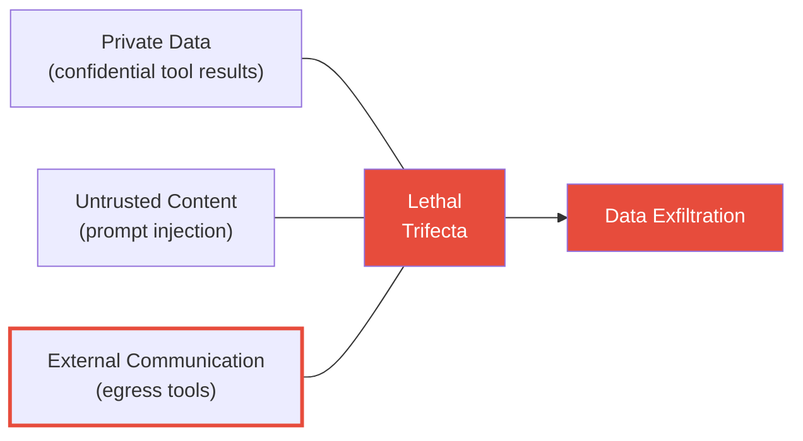
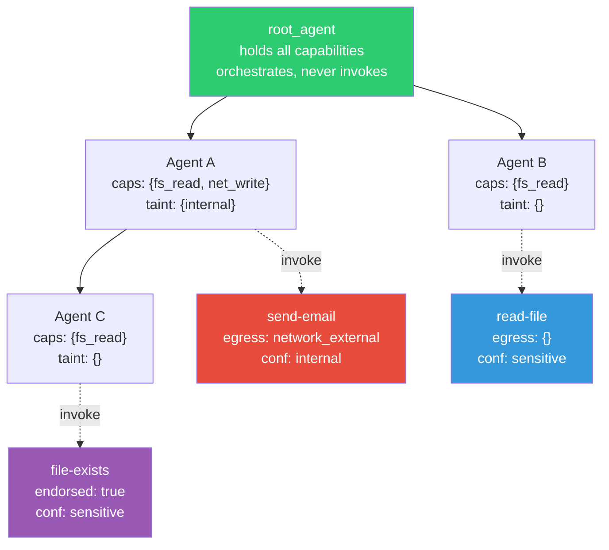
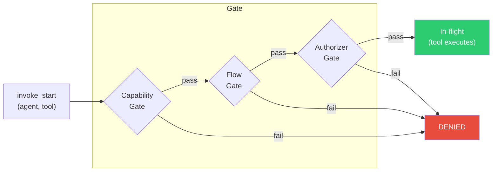
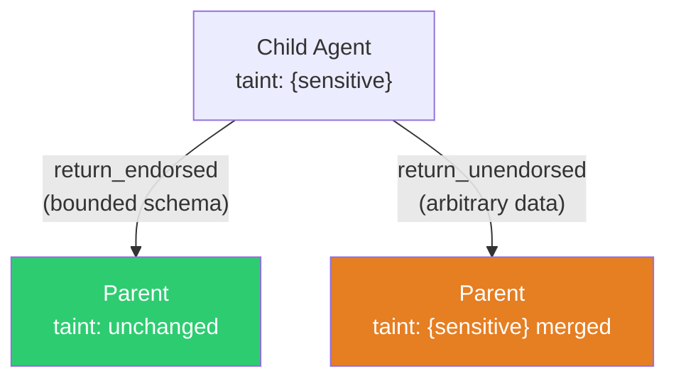
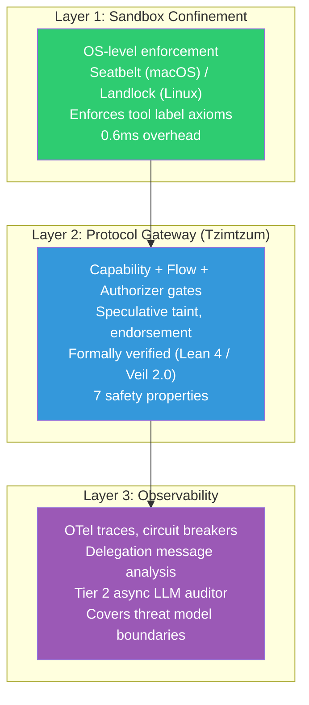

# Tzimtzum v2.3

A formally verified security kernel for LLM tool authorization.
Part of the [Argus](../argus/) Tool Authorization Gateway.

Tzimtzum is a protocol specification -- written in [Lean 4](https://lean-lang.org/) using
the [Veil](https://github.com/verse-lab/veil) verification framework -- that defines how
LLM agents can safely invoke tools without leaking private data through indirect prompt
injection attacks. All 7 safety properties and 12 strengthening invariants are verified
automatically via push-button SMT (cvc5). No manual proofs required.

## The Problem

The **Lethal Trifecta** ([Simon Willison, 2025](https://simonwillison.net/2025/Jun/16/the-lethal-trifecta/)):

> **Private data + Untrusted content + External communication = Exfiltration**

If all three legs are present, indirect prompt injection can always extract data. The only
structural defense is to remove one leg. Tzimtzum removes the third -- it enforces
authorization at tool boundaries so that a confused (prompt-injected) agent cannot reach
egress channels when it carries taint from private data.



Tzimtzum blocks the connection between tainted agents and egress channels via a graduated
flow policy (ALLOW / INSPECT / DENY), enforced deterministically at every tool invocation.

## Architecture

Agents form a tree rooted at a single `root_agent`. Each agent carries:

- **Capabilities** -- typed permissions flowing strictly downward (parent to child, never upward)
- **Taint set** -- confidentiality levels the agent has been exposed to (grows monotonically, max 4 values)
- **In-flight set** -- currently executing tool invocations (for speculative taint)

Tools are registered with immutable, static labels: required capabilities, egress kinds,
confidentiality floor, and endorsement status. Labels never change after registration.



### The Three-Check Invoke Gate

Every tool invocation passes through three independent checks. If any fails, the
invocation is denied (default-deny).



**Check 1 -- Capability gate.** The agent holds every capability the tool requires.
Simple set containment.

**Check 2 -- Flow gate.** For each (taint_level, egress_kind) pair, the flow policy
must permit it:

| Mode | Meaning |
|------|---------|
| **ALLOW** | No restriction. Data at this level can reach this egress freely. |
| **INSPECT** | Permitted only if a content gate certifies the arguments are safe. |
| **DENY** | Hard block. No invocation possible. **(Default for all pairs.)** |

The flow gate checks **speculative taint** -- the worst-case taint including all in-flight
non-endorsed tools. This eliminates TOCTOU races and enables safe parallel tool execution.

**Check 3 -- Authorizer gate.** An external policy engine (e.g. Cedar) authorizes the
specific (agent, tool) pair. Parameter-level conditions (regex on arguments, recipient
allowlists) live here.

### Speculative Taint

The key mechanism enabling parallel execution. When the flow gate runs, it checks not just
the agent's current taint but also the potential taint from all tools currently executing:

```
speculative_taint(A, L) =
    taint_levels(A, L)
    OR (exists I, in_flight(A, I)
        AND tool_conf_floor(invocation_tool(I)) = L
        AND NOT tool_endorsed(invocation_tool(I)))
```

This guarantees flow confinement holds regardless of the order in which concurrent tools
complete. The conservatism only affects the dangerous case -- attempting egress while
taint-producing tools are in-flight -- which is exactly the race being prevented.

### Endorsed Tools

Tools with bounded output schemas (boolean, enum, bounded integer) are **endorsed**. Their
results carry at most a few bits of information and do not add taint on completion. This is
the anti-taint-accumulation mechanism -- it prevents agents from becoming permanently
blocked after touching any non-public data.

## The 9 Actions

| # | Action | Purpose |
|---|--------|---------|
| 1 | `register_tool` | Add a tool with static immutable labels |
| 2 | `delegate` | Create a child agent with empty capabilities and taint |
| 3 | `grant_capability` | Grant a single capability downward (parent to child) |
| 4 | `revoke` | Parent removes a direct child (full cleanup) |
| 5 | `cascade_revoke` | Propagate revocation to orphaned children |
| 6 | `invoke_start` | Three-check authorization gate; marks invocation in-flight |
| 7 | `invoke_complete` | Tool finished; apply taint if non-endorsed |
| 8 | `return_endorsed` | Child returns bounded result (no taint propagation) |
| 9 | `return_unendorsed` | Child returns unbounded result (taint propagates via union; flow gate checks compatibility with parent's in-flight tools) |

### Information Flow on Return



## Verified Safety Properties

All properties are verified inductively: they hold in the initial state and every action
preserves them. Verification is fully automatic via Veil 2.0 + cvc5 (push-button SMT).

| # | Property | Statement |
|---|----------|-----------|
| 1 | **root_always_active** | The root agent can never be deactivated |
| 2 | **default_deny** | In-flight invocations imply explicit authorization AND capability coverage |
| 3 | **flow_confinement** | Tainted agents cannot reach egress channels unless the flow policy permits it (ALLOW, INSPECT+pass, or scoped override) |
| 4 | **capability_subsumption** | Child capabilities are always a subset of parent capabilities |
| 5 | **revocation_clean** | Inactive agents have no in-flight invocations and no taint |
| 6 | **taint_integrity** | Every taint level is traceable to an invocation or a child return |
| 7 | **flow_confinement_weak** | DENY-mode (level, egress) pairs are structurally blocked regardless of oracle behavior |

**flow_confinement** is the core property -- the Lethal Trifecta defense. Formally:

```
taint_levels A L /\ in_flight A I /\ tool_egress (invocation_tool I) E ->
    flow_allows L E
    \/ (flow_inspects L E /\ content_gate_passes A (invocation_tool I))
    \/ flow_override A (invocation_tool I) L
```

12 strengthening invariants support the inductive proof: tree well-formedness (4),
in-flight well-formedness (3), root properties (2), ghost relation soundness (2),
and in-flight flow compatibility (1).

## Three-Layer Defense

Tzimtzum is Layer 2 of a three-layer defense architecture. Each layer uses fundamentally
different mechanisms, so a single exploit technique cannot bypass all three.



| Layer | Role | Mechanism |
|-------|------|-----------|
| **Layer 1** | Prevent resource access beyond declared labels | OS kernel sandboxing (Seatbelt/Landlock) |
| **Layer 2** | Enforce authorization at tool boundaries | Formally verified state machine (this spec) |
| **Layer 3** | Detect what the protocol cannot model | OTel traces, circuit breakers, async LLM audit |

## Trust Assumptions

The safety properties are conditional on these axioms. Each has a corresponding enforcement
mechanism outside the formal model.

| # | Assumption | Enforcement |
|---|-----------|-------------|
| **A1** | Tool labels are correct (egress kinds, confidentiality floor) | Layer 1 sandbox-label consistency. Mismatch triggers quarantine. |
| **A2** | Authorizer policies are well-formed | Z3 policy overlap analysis at deploy time. |
| **A3** | State transitions serialize on global state (tool execution is parallel) | Single-writer gateway. Speculative taint handles concurrent execution. |
| **A4** | Content gate correctly identifies sensitive data in arguments | Four-paradigm inspection pipeline: Cedar regex, EDM fingerprinting, literal matching, embedding similarity. |

## What Tzimtzum Does NOT Defend Against

These are fundamental limitations shared with other IFC/capability systems.

| Boundary | Attack Vector | Why Undefendable | Mitigation |
|----------|--------------|------------------|------------|
| **B1** | Instruction-channel encoding (data in delegation messages) | Protocol tracks tool-result provenance, not instruction content | Delegation message size cap + depth limit from tainted parents. Layer 3 semantic analysis. |
| **B2** | Endorsed return bandwidth (1-16 bits/call over many calls) | Type-bounded outputs are small but nonzero | Per-session rate limits on endorsed invocations |
| **B3** | Implicit flows within agent reasoning | No system tracks implicit flows in LLM reasoning | Layer 3 goal-divergence auditor |
| **B4** | Adversarially controlled LLM (compromised weights, not just injected) | Protocol assumes confused agent, not malicious agent | Model provenance verification (out of scope) |
| **B5** | Covert side channels (timing, tool selection, error messages, ordering) | Control-plane channels exist in any tool-calling system | Layer 3 anomaly detection on invocation patterns |

### What This Means

Given correct labels (A1), well-formed policies (A2), atomic state transitions (A3),
and accurate content gate (A4): **no confused agent can violate flow confinement at tool
boundaries**. DENY-mode pairs are structurally blocked. INSPECT-mode pairs are
content-gated. This is a precise, provable claim. Everything outside this boundary is
defense-in-depth.

## Building

Requires [Lean 4.27.0](https://github.com/leanprover/lean4/releases) and an internet
connection (Veil is fetched from git on first build).

```bash
cd tzimtzum

# Full build + verification (fetches Veil, runs #gen_spec and #check_invariants)
lake build --old

# Or via Makefile
make build

# Faster incremental builds
LEAN_NUM_THREADS=12 lake build --old
```

The `#gen_spec` command assembles the relational transition system (~60s with
`maxHeartbeats 6000000`). `#check_invariants` sends all verification conditions to cvc5.

### Known Build Artifact

`#gen_spec` produces cosmetic `LawfulFieldRepresentation` synthesis errors during RTS
definition generation. These are a [Veil 2.0 framework limitation](https://github.com/verse-lab/veil)
(header-first elaboration can't synthesize trivial `IsSubStateOf` proofs). They do not
affect verification -- `#check_invariants` uses a separate code path and all VCs pass.

## File Structure

```
tzimtzum/
  TzimtzumV2.lean   -- The complete formal specification (~648 lines)
  lakefile.lean      -- Lake build configuration (depends on Veil 2.0)
  README.md          -- This file
```

The entire protocol -- sorts, axioms, state, actions, safety properties, invariants, and
verification commands -- lives in a single Lean file.

## References

### This Project

- Tzimtzum v2.3 formal spec: [`TzimtzumV2.lean`](./TzimtzumV2.lean)
- Argus Tool Authorization Gateway: [`../argus/`](../argus/)

### The Problem

- Willison, S. (2025). [The Lethal Trifecta](https://simonwillison.net/2025/Jun/16/the-lethal-trifecta/)

### Verification Framework

- Veil 2.0 -- Push-button verification for distributed protocols: [github.com/verse-lab/veil](https://github.com/verse-lab/veil)
- Lean 4 theorem prover: [lean-lang.org](https://lean-lang.org/)

### Academic Prior Art

The protocol design synthesizes ideas from these papers:

| Paper | Key Contribution Adopted |
|-------|--------------------------|
| [Fides](https://arxiv.org/abs/2505.23643) (Microsoft Research, 2025) | Type-bounded endorsement for taint-creep prevention |
| [CaMeL](https://arxiv.org/abs/2503.18813) (DeepMind, 2025) | Side-effect classification, default-deny |
| [Progent](https://arxiv.org/abs/2504.11703) (2025) | Parameter-level policy conditions, Z3 overlap analysis |
| [PFI](https://arxiv.org/abs/2503.15547) (2025) | DataGuard literal matching, opaque data references |
| [SEAgent](https://arxiv.org/abs/2601.11893) (2026) | Multi-hop flow graph analysis |
| [LlamaFirewall](https://arxiv.org/abs/2505.03574) (Meta, 2025) | Two-tiered scanning architecture |
| [AgentBound](https://arxiv.org/abs/2510.21236) (2025) | Manifest-based sandbox enforcement |
| [MiniScope](https://arxiv.org/abs/2512.11147) (UC Berkeley, 2025) | ILP-based minimal capability scoping |

### Additional References

- [Horus -- Trustless Delegation](https://arxiv.org/abs/2507.00631) (evaluated, rejected as over-engineered)
- [Inter-Agent Trust Models](https://arxiv.org/abs/2511.03434) (Brief/Claim/Proof taxonomy)
- [Open Challenges in Multi-Agent Security](https://arxiv.org/abs/2505.02077) (steganographic collusion)
- [Systems Security Foundations for Agentic Computing](https://arxiv.org/abs/2512.01295)
- [OWASP Top 10 for Agentic Applications 2026](https://genai.owasp.org/resource/owasp-top-10-for-agentic-applications-for-2026/)
