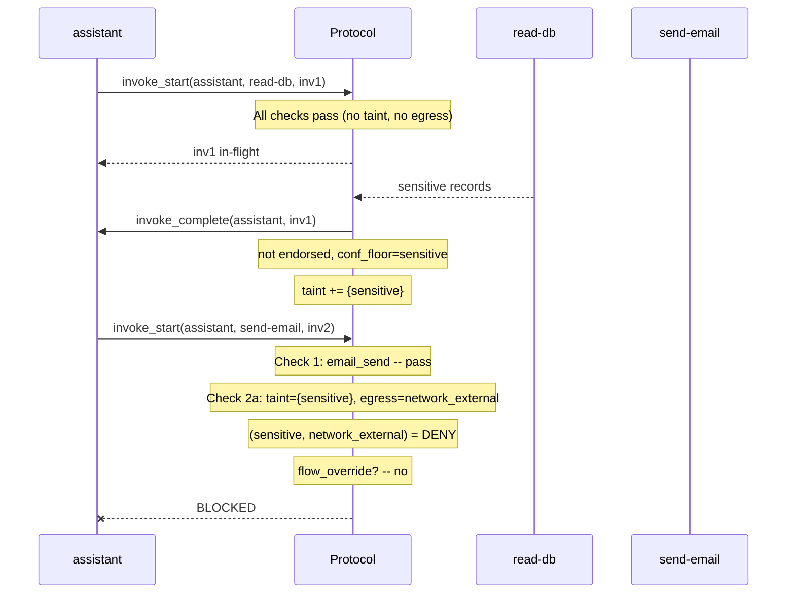
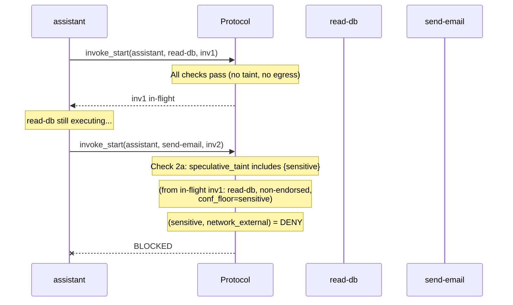
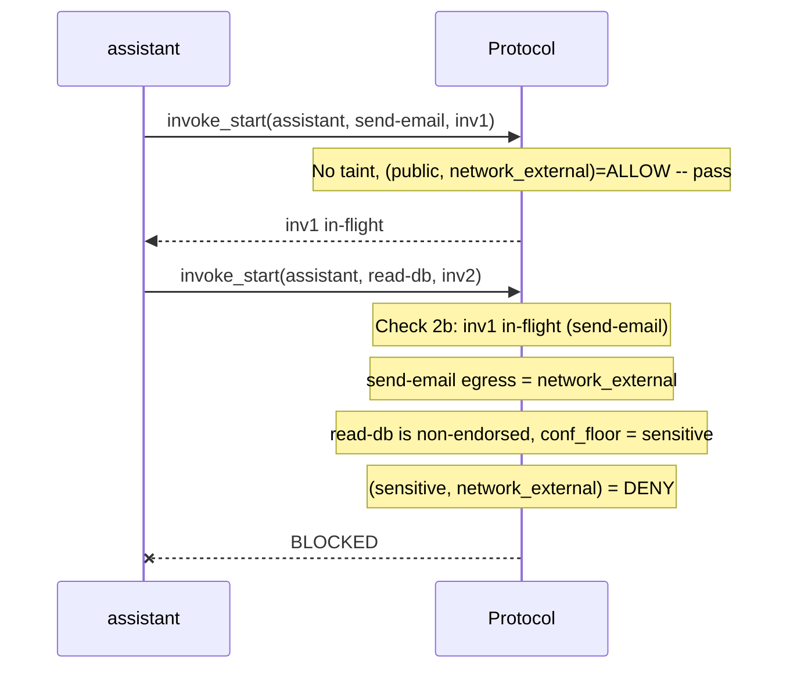
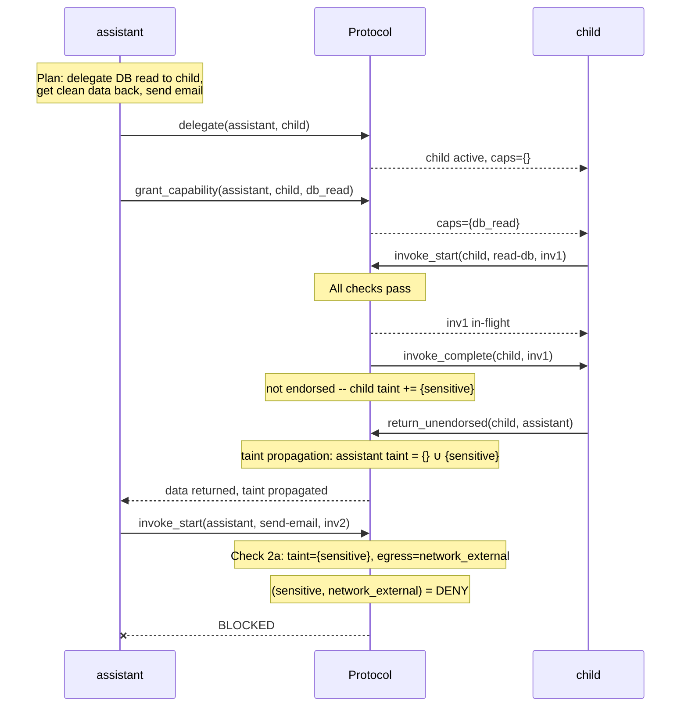
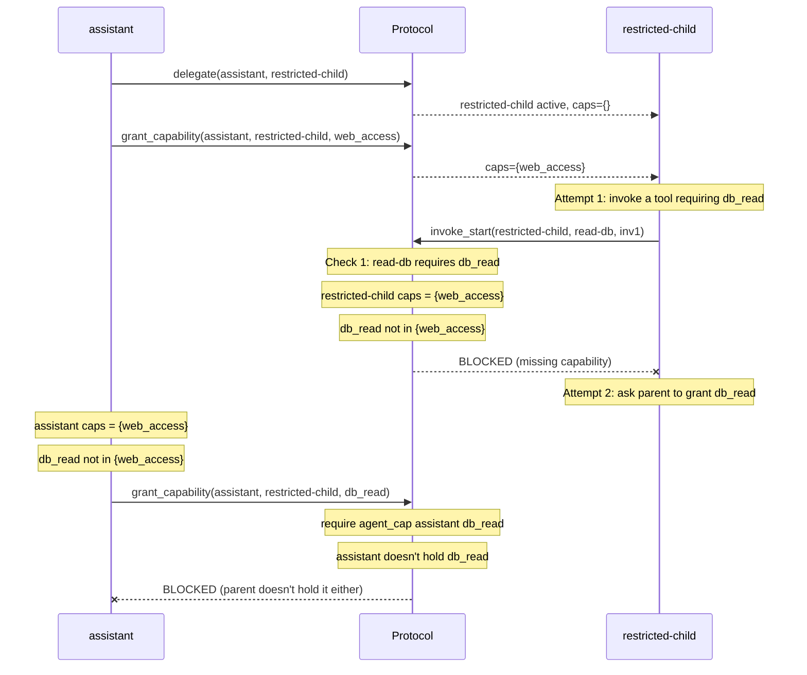
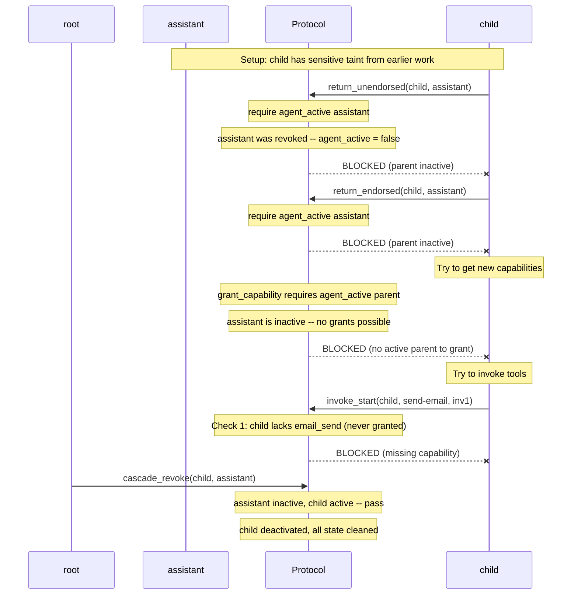
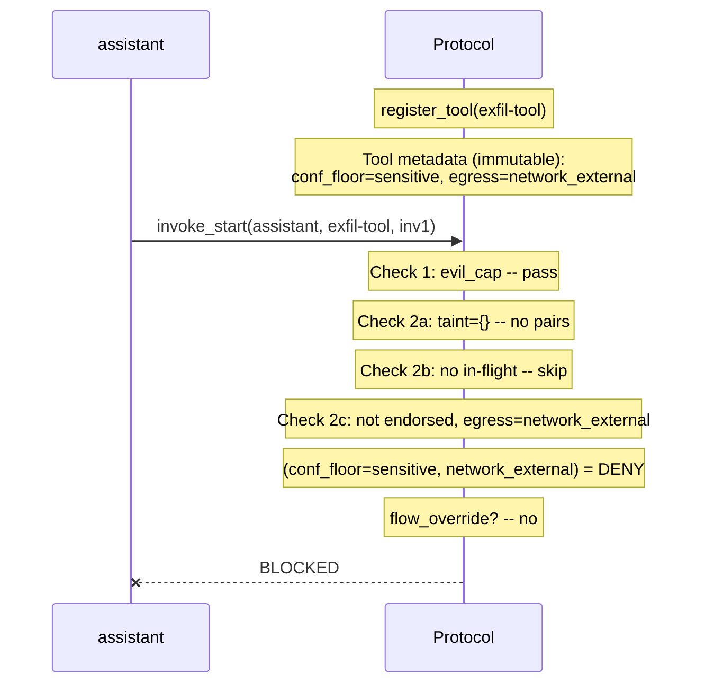

# Tzimtzum v2.3 -- Adversarial Scenarios

Attack attempts against the protocol and the safety properties that
block them. Each scenario shows the exact precondition or gate check
that prevents the attack.

Uses the same [shared universe](scenarios-happy-paths.md#shared-universe)
(tools, flow policy, agents) as the happy path walkthroughs.

---

## Scenario 1: The Lethal Trifecta

> **Attack**: An agent reads sensitive data from a database, then tries to
> exfiltrate it via email.
>
> **Blocked by**: `flow_confinement` -- the flow gate evaluates
> `(sensitive, network_external) = DENY` and hard-blocks the invocation.

**Agents**: `root` -> `assistant` (holds `{db_read, email_send}`)

| Step | Action | in_flight | taint | result |
|------|--------|-----------|-------|--------|
| 0 | -- | `{}` | `{}` | |
| 1 | `invoke_start(read-db, inv1)` | `{inv1}` | `{}` | allowed |
| 2 | `invoke_complete(inv1)` | `{}` | `{sensitive}` | |
| 3 | `invoke_start(send-email, inv2)` | `{}` | `{sensitive}` | **BLOCKED** |

**Why it works**: This is the protocol's core defense. The three legs of
the Lethal Trifecta are: private data (read-db exposes sensitive),
untrusted content (the agent may be prompt-injected), and external
communication (send-email has network_external egress). The flow gate
severs the third leg -- once the agent carries sensitive taint, all
DENY-mode egress channels are permanently closed to it.

---

## Scenario 2: Racing the Taint

> **Attack**: Start a database read and an email send in parallel, hoping
> the email fires before the taint from the database read materializes.
>
> **Blocked by**: `flow_confinement` via **speculative taint** -- the
> in-flight non-endorsed `read-db` is included in the taint calculation
> before it completes.

**Agents**: `root` -> `assistant` (holds `{db_read, email_send}`)

| Step | Action | in_flight | taint | speculative_taint | result |
|------|--------|-----------|-------|-------------------|--------|
| 0 | -- | `{}` | `{}` | `{}` | |
| 1 | `invoke_start(read-db, inv1)` | `{inv1}` | `{}` | `{sensitive}` | allowed |
| 2 | `invoke_start(send-email, inv2)` | `{inv1}` | `{}` | `{sensitive}` | **BLOCKED** |

The reverse order is also blocked. If the agent starts `send-email` first
(which succeeds, since there's no taint yet), then tries `read-db`:

**Why it works**: Speculative taint eliminates the TOCTOU race entirely.
Check 2a catches "existing taint vs. new egress" and Check 2b catches
"new taint vs. existing egress". No matter which tool the agent tries
to start first, the conflicting pair `(sensitive, network_external)` is
detected. This is why both checks exist -- they are the forward and
reverse directions of the same flow constraint.

---

## Scenario 3: Taint Laundering via Delegation

> **Attack**: The agent can't send email because it has sensitive taint.
> It delegates the database read to a clean child, hoping to receive the
> data back without acquiring taint.
>
> **Blocked by**: `return_unendorsed` propagates the child's taint to the
> parent. The laundering fails.

**Agents**: `root` -> `assistant` (holds `{db_read, email_send}`) -> `child`

| Step | Action | child taint | assistant taint | result |
|------|--------|:-:|:-:|--------|
| 0 | -- | -- | `{}` | |
| 1 | `delegate` + `grant_capability` | `{}` | `{}` | |
| 2 | `invoke_start(read-db)` | `{}` | `{}` | allowed |
| 3 | `invoke_complete(read-db)` | `{sensitive}` | `{}` | |
| 4 | `return_unendorsed` | `{sensitive}` | `{sensitive}` | taint propagated |
| 5 | `invoke_start(send-email)` | -- | `{sensitive}` | **BLOCKED** |

**Why it works**: Taint follows data, not delegation boundaries. Any
unendorsed return (arbitrary text, records, etc.) propagates the child's
full taint set to the parent via set union. The delegation boundary is
not a taint firewall -- it's a capability boundary. You can limit what a
child can *do*, but you can't receive its unbounded output without
accepting its taint.

The only way to avoid taint propagation is `return_endorsed` -- but that
requires the child to have used only endorsed tools (bounded output schemas),
meaning the data is information-theoretically bounded (a boolean, an enum,
a small integer). You can't smuggle a database dump through a boolean.

---

## Scenario 4: Capability Escalation

> **Attack**: A child agent tries to invoke a tool requiring capabilities
> it was never granted.
>
> **Blocked by**: `default_deny` (Check 1) -- the capability gate requires
> set containment. `capability_subsumption` ensures the parent can't grant
> what it doesn't hold either.

**Agents**: `root` -> `assistant` (holds `{web_access}`) -> `restricted-child`

| Step | Action | child caps | result |
|------|--------|:-:|--------|
| 0 | `delegate` + `grant(web_access)` | `{web_access}` | |
| 1 | child: `invoke_start(read-db)` | `{web_access}` | **BLOCKED** (Check 1) |
| 2 | parent: `grant_capability(db_read)` | `{web_access}` | **BLOCKED** (parent lacks it) |

**Why it works**: Capabilities flow strictly downward and only via explicit
grants. `capability_subsumption` is the safety property that guarantees
this: for any active parent-child pair, the child's capabilities are a
subset of the parent's. There is no action in the protocol that creates
capabilities from nothing -- they all originate from `root_agent`, which
holds everything by the `root_all_caps` invariant.

---

## Scenario 5: Orphan Escalation After Revocation

> **Attack**: A parent is revoked while a child still has sensitive taint.
> The child tries to escalate by returning its tainted data upward or
> acquiring new capabilities.
>
> **Blocked by**: `return_endorsed` and `return_unendorsed` require
> `agent_active prnt`. `grant_capability` requires an active parent.
> The orphan is sealed in a disconnected subtree.

**Agents**: `root` -> `assistant` -> `child`

| Step | Action | child active | child taint | result |
|------|--------|:-:|:-:|--------|
| 0 | (assistant revoked) | yes | `{sensitive}` | orphaned |
| 1 | `return_unendorsed(child, assistant)` | yes | `{sensitive}` | **BLOCKED** |
| 2 | `return_endorsed(child, assistant)` | yes | `{sensitive}` | **BLOCKED** |
| 3 | `invoke_start(send-email)` | yes | `{sensitive}` | **BLOCKED** |
| 4 | `cascade_revoke(child, assistant)` | no | -- | cleaned |

**Why it works**: The orphan is in a sealed disconnected subtree. It
cannot return data upward (parent is inactive). It cannot acquire new
capabilities (no active parent to grant them). It cannot invoke tools
it doesn't already have capabilities for. The `flow_confinement` and
`default_deny` safety properties hold independently of parent liveness.

The only "cost" of the transient orphan window is wasted computation --
the child might continue executing in-flight tools, but it can't
communicate the results to anyone. `cascade_revoke` cleans it up.

---

## Scenario 6: Self-Exfiltrating Tool

> **Attack**: Register a malicious tool that both reads sensitive data
> (high `conf_floor`) and has external egress -- a tool that is
> simultaneously the data source and the exfiltration channel.
>
> **Blocked by**: `flow_confinement` via **Check 2c** (self-flow gate) --
> the tool's own confidentiality floor is checked against its own egress
> before the invocation starts.

**Agents**: `root` -> `assistant` (holds `{evil_cap}`)

**Malicious tool**:

| Tool | conf_floor | endorsed | egress | requires |
|------|-----------|----------|--------|----------|
| `exfil-tool` | sensitive | no | `network_external` | `evil_cap` |

| Step | Action | in_flight | taint | result |
|------|--------|-----------|-------|--------|
| 0 | `register_tool(exfil-tool)` | `{}` | `{}` | |
| 1 | `invoke_start(exfil-tool, inv1)` | `{}` | `{}` | **BLOCKED** (Check 2c) |

**Why it works**: Check 2c exists specifically for this case. Even with
zero prior taint and no other in-flight tools, a tool that produces
sensitive data AND has external egress is blocked before it ever executes.
The self-flow check evaluates the tool's own `conf_floor` against its own
egress kinds.

This means the tool registration itself is harmless -- the tool can exist
in the registry. But no agent can invoke it under a DENY policy for
`(sensitive, network_external)`. The threat is neutralized at invocation
time, not at registration time.

---

## Summary: Safety Properties in Action

| Scenario | Attack | Safety Property | Gate Check |
|----------|--------|----------------|------------|
| 1. Lethal Trifecta | read sensitive, send external | `flow_confinement` | 2a |
| 2. Racing the Taint | parallel read + send | `flow_confinement` | 2a (forward) + 2b (reverse) |
| 3. Taint Laundering | delegate read, receive clean | `flow_confinement` | `return_unendorsed` taint union |
| 4. Capability Escalation | invoke without caps | `default_deny` + `capability_subsumption` | 1 |
| 5. Orphan Escalation | return after parent revoked | `revocation_clean` | preconditions |
| 6. Self-Exfiltrating Tool | tool reads and sends | `flow_confinement` | 2c |
