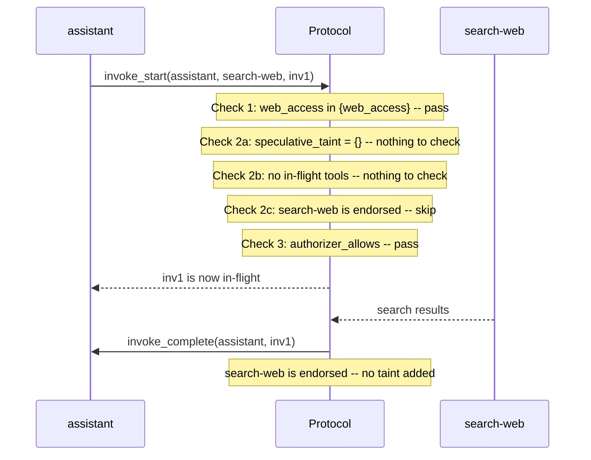
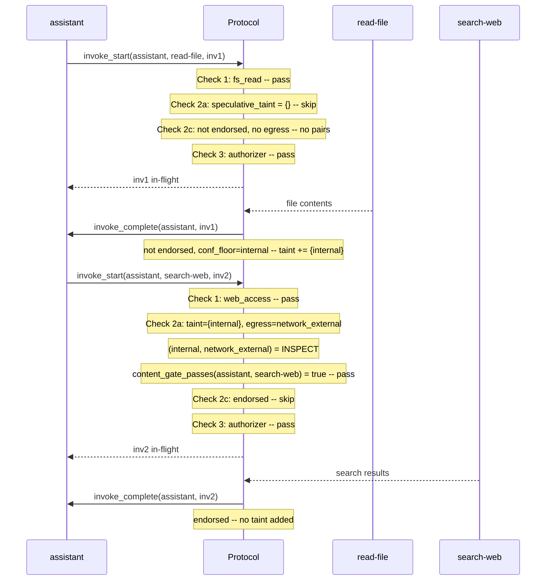
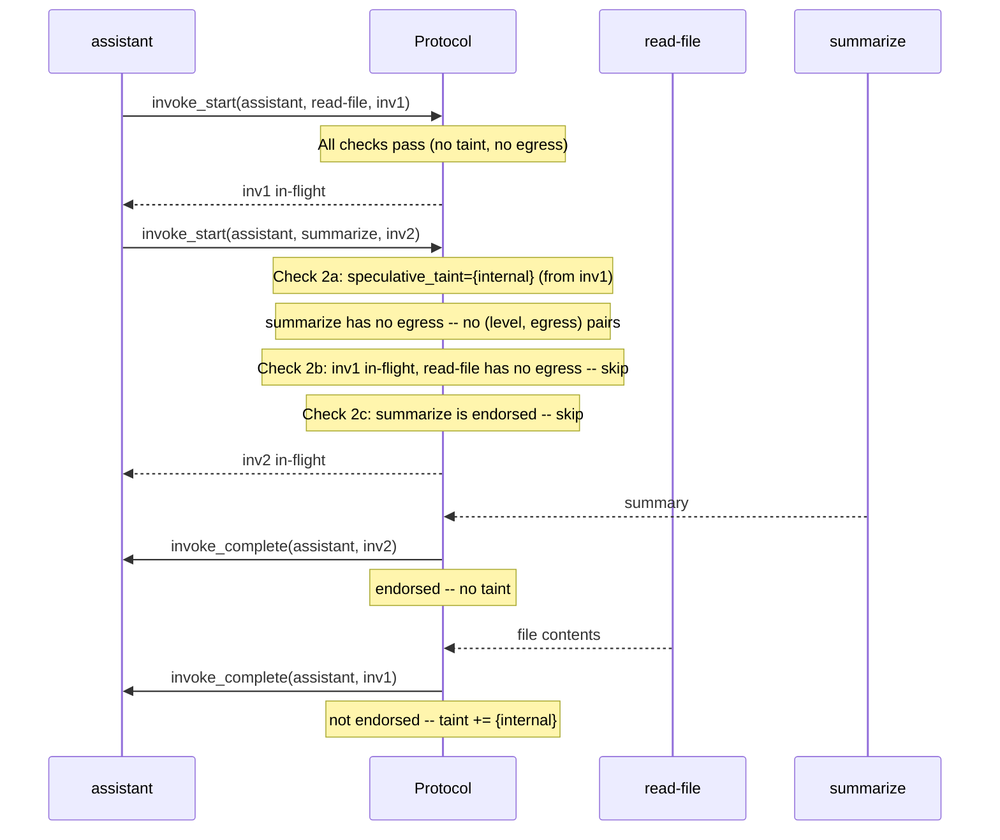
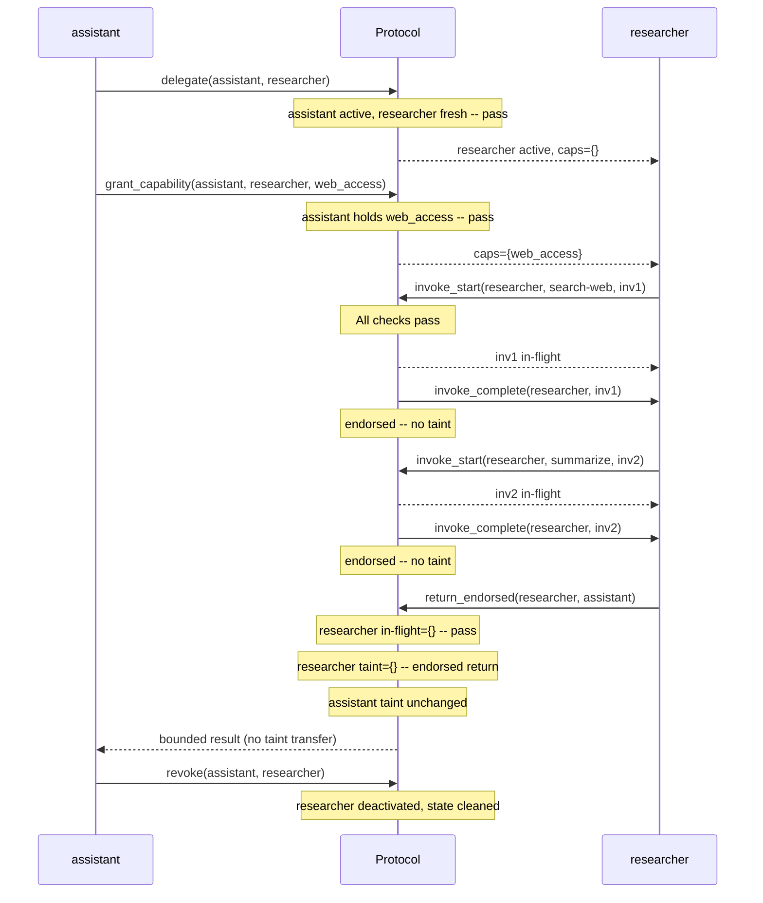
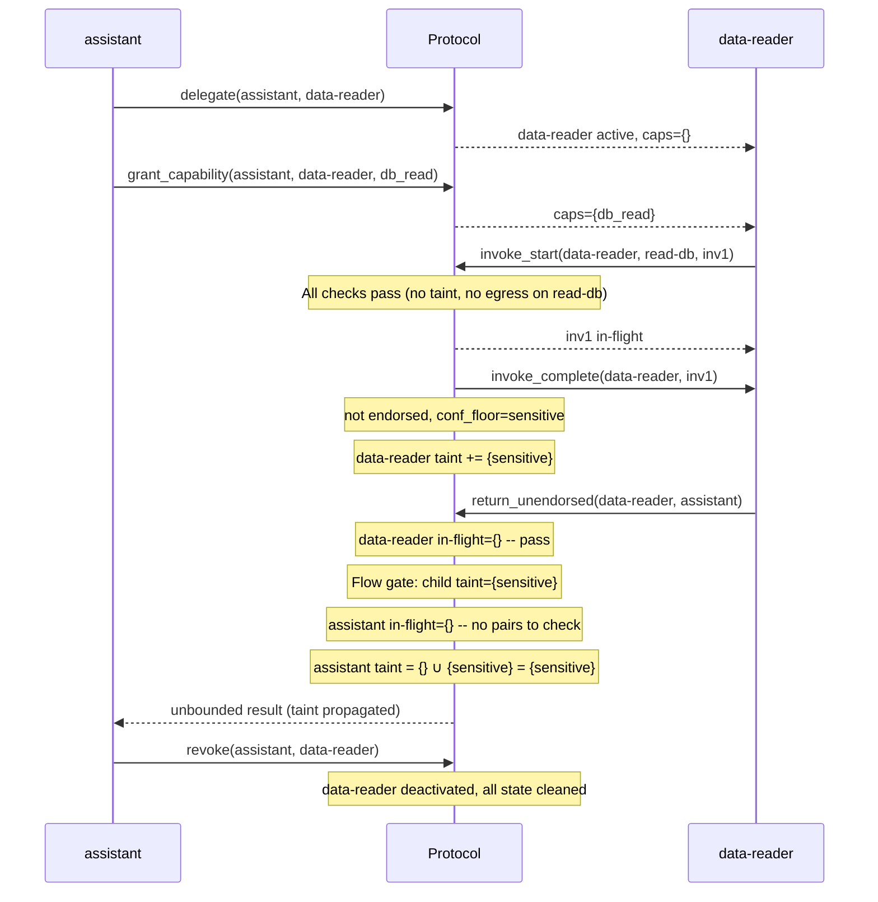

# Tzimtzum v2.3 -- Scenario Walkthroughs

Concrete traces through the protocol's 9 actions. Each scenario shows
every action fired, the three-check gate evaluation, and the state after
each step.

## Shared Universe

### Tools

| Tool | conf_floor | endorsed | egress | requires |
|------|-----------|----------|--------|----------|
| `read-db` | sensitive | no | -- | `db_read` |
| `send-email` | public | no | `network_external` | `email_send` |
| `search-web` | public | yes | `network_external` | `web_access` |
| `summarize` | public | yes | -- | -- |
| `post-slack` | public | no | `network_external` | `messaging` |
| `read-file` | internal | no | -- | `fs_read` |
| `query-api` | sensitive | no | `network_internal` | `api_access` |

### Flow Policy

| (level, egress) | mode |
|-----------------|------|
| (public, network_external) | ALLOW |
| (internal, network_external) | INSPECT |
| (sensitive, network_external) | **DENY** |
| (public, network_internal) | ALLOW |
| (internal, network_internal) | ALLOW |
| (sensitive, network_internal) | INSPECT |

Unlisted pairs default to **DENY**.

### How to Read the Gate Checks

Every `invoke_start` evaluates three independent checks:

1. **Check 1 (Capability)**: agent holds every capability the tool requires
2. **Check 2 (Flow gate)**: three sub-checks ensuring no (taint, egress) pair violates policy
   - **2a**: existing speculative taint vs. new tool's egress
   - **2b**: new tool's potential taint vs. existing in-flight tools' egress
   - **2c**: new tool's own taint vs. its own egress (self-flow)
3. **Check 3 (Authorizer)**: external policy engine says yes

---

## Scenario 1: Simple Search

> An agent invokes an endorsed tool with no prior taint. The fast path --
> every check is trivially satisfied.

**Agents**: `root` -> `assistant` (holds `{web_access}`)

| Step | Action | in_flight | taint | speculative_taint |
|------|--------|-----------|-------|-------------------|
| 0 | -- | `{}` | `{}` | `{}` |
| 1 | `invoke_start(search-web, inv1)` | `{inv1}` | `{}` | `{}` |
| 2 | `invoke_complete(inv1)` | `{}` | `{}` | `{}` |

**Takeaway**: Endorsed tools are the fast path. No taint accumulates,
so future invocations face zero flow gate friction.

---

## Scenario 2: Read Then Search (INSPECT Mode)

> An agent reads a local file (gaining `internal` taint), then searches
> the web. The flow gate evaluates `(internal, network_external) = INSPECT`
> and the content gate certifies the search query doesn't leak the file data.

**Agents**: `root` -> `assistant` (holds `{fs_read, web_access}`)

| Step | Action | in_flight | taint | speculative_taint |
|------|--------|-----------|-------|-------------------|
| 0 | -- | `{}` | `{}` | `{}` |
| 1 | `invoke_start(read-file, inv1)` | `{inv1}` | `{}` | `{internal}` |
| 2 | `invoke_complete(inv1)` | `{}` | `{internal}` | `{internal}` |
| 3 | `invoke_start(search-web, inv2)` | `{inv2}` | `{internal}` | `{internal}` |
| 4 | `invoke_complete(inv2)` | `{}` | `{internal}` | `{internal}` |

**Takeaway**: INSPECT is the graduated middle ground between ALLOW and DENY.
The content gate (deterministic inspection pipeline) certifies the outgoing
arguments don't contain the tainted data. If the content gate fails,
the invocation is blocked -- same as DENY for that specific call.

---

## Scenario 3: Parallel Safe Invocations

> An agent starts `read-file` and `summarize` concurrently. Speculative
> taint from the in-flight `read-file` is conservative but doesn't block
> `summarize` because it has no egress channel.

**Agents**: `root` -> `assistant` (holds `{fs_read}`)

| Step | Action | in_flight | taint | speculative_taint |
|------|--------|-----------|-------|-------------------|
| 0 | -- | `{}` | `{}` | `{}` |
| 1 | `invoke_start(read-file, inv1)` | `{inv1}` | `{}` | `{internal}` |
| 2 | `invoke_start(summarize, inv2)` | `{inv1, inv2}` | `{}` | `{internal}` |
| 3 | `invoke_complete(inv2)` | `{inv1}` | `{}` | `{internal}` |
| 4 | `invoke_complete(inv1)` | `{}` | `{internal}` | `{internal}` |

**Takeaway**: Speculative taint is conservative (worst-case from all
in-flight non-endorsed tools) but precise about what it blocks. Tools
without egress never conflict with taint, so they always run in parallel
with anything.

---

## Scenario 4: Delegation with Endorsed Return

> Assistant delegates a researcher child for web search. The child uses
> only endorsed tools, so the parent receives zero taint on return.

**Agents**: `root` -> `assistant` (holds `{web_access}`) -> `researcher`

| Step | Action | researcher active | researcher taint | assistant taint |
|------|--------|:-:|:-:|:-:|
| 0 | -- | no | -- | `{}` |
| 1 | `delegate` | yes | `{}` | `{}` |
| 2 | `grant_capability(web_access)` | yes | `{}` | `{}` |
| 3 | `invoke_start(search-web)` | yes | `{}` | `{}` |
| 4 | `invoke_complete(search-web)` | yes | `{}` | `{}` |
| 5 | `invoke_start(summarize)` | yes | `{}` | `{}` |
| 6 | `invoke_complete(summarize)` | yes | `{}` | `{}` |
| 7 | `return_endorsed` | yes | `{}` | `{}` |
| 8 | `revoke` | no | -- | `{}` |

**Takeaway**: Endorsed tools + endorsed return = zero taint propagation
through the entire delegation chain. This is the ideal pattern for
isolated tasks: the parent stays clean regardless of how many endorsed
tools the child uses.

---

## Scenario 5: Full Lifecycle with Taint Propagation

> Assistant delegates a child to read from a database. The child acquires
> sensitive taint, returns the data (unendorsed), and the parent inherits
> the taint. The child is then revoked.

**Agents**: `root` -> `assistant` (holds `{db_read}`) -> `data-reader`

| Step | Action | data-reader active | data-reader taint | assistant taint |
|------|--------|:-:|:-:|:-:|
| 0 | -- | no | -- | `{}` |
| 1 | `delegate` | yes | `{}` | `{}` |
| 2 | `grant_capability(db_read)` | yes | `{}` | `{}` |
| 3 | `invoke_start(read-db)` | yes | `{}` | `{}` |
| 4 | `invoke_complete(read-db)` | yes | `{sensitive}` | `{}` |
| 5 | `return_unendorsed` | yes | `{sensitive}` | `{sensitive}` |
| 6 | `revoke` | no | -- | `{sensitive}` |

**Takeaway**: `return_unendorsed` is the taint propagation mechanism.
The parent inherits the child's full taint set via set union. This is
conservative but prevents taint laundering: you cannot avoid acquiring
taint by delegating the sensitive read to a child. The data flows up,
and the taint follows it.

Note that after step 6, the assistant carries `{sensitive}` taint
permanently. Any future invocation of a tool with `network_external`
egress will be evaluated against `(sensitive, network_external) = DENY`.
